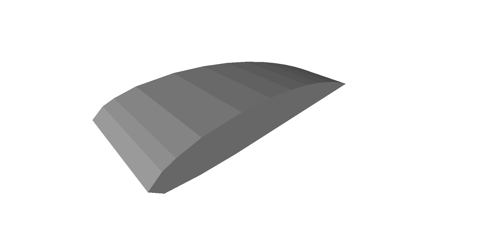
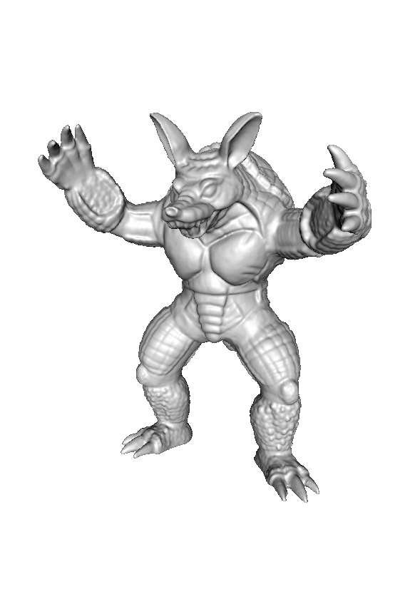

This folder contains various PLY surface grids.
The grids have been obtained from various sources (outlined below) and repaired (and thus modified) using MeshLab.

* airfoil.ply Obtained from equivalent STL file in AMReX-tutorials source code (https://github.com/AMReX-Codes/amrex-tutorials.git), commit 211e40b0504dd5660ed2ff2605ea9f542b176cb2.

* armadillo.ply Obtained from Stanford 3D scanning repository (http://graphics.stanford.edu/data/3Dscanrep/).

* dodecahedron.ply Obtained from https://people.sc.fsu.edu/~jburkardt/data/ply/ply.html

* horse.ply Obtained from https://github.com/alecjacobson/common-3d-test-models and repaired (made watertight) using MeshLab.

* orion.ply Obtained from NASA https://nasa3d.arc.nasa.gov/detail/orion-capsule

* porsche.ply Obtained from https://people.sc.fsu.edu/~jburkardt/data/ply/ply.html

* sphere.ply Obtained from https://people.sc.fsu.edu/~jburkardt/data/ply/ply.html

| Model Name | Image | File          | Source     |
|------------|-------|---------------|------------|
| Airfoil    |  | [.ply](airfoil.ply)   | [AMReX](http://git@github.com/AMReX-Codes/amrex-tutorials.git) |
| Armadillo  |  | [.ply](armadillo.ply) | [Stanford](http://graphics.stanford.edu/data/3Dscanrep/)       |
