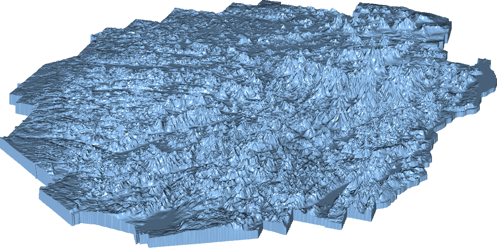
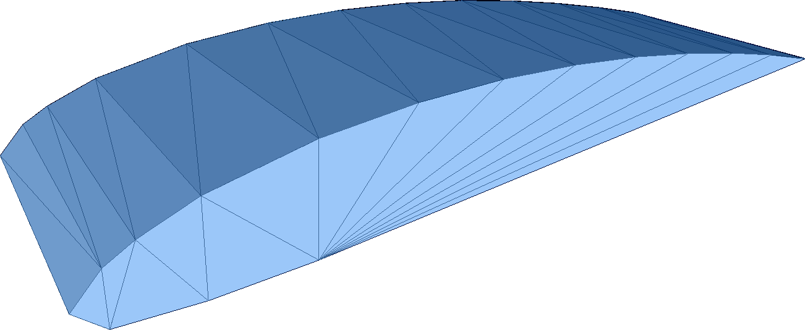
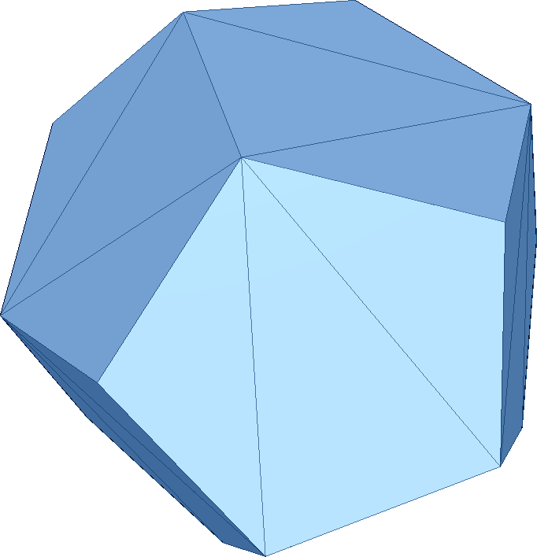
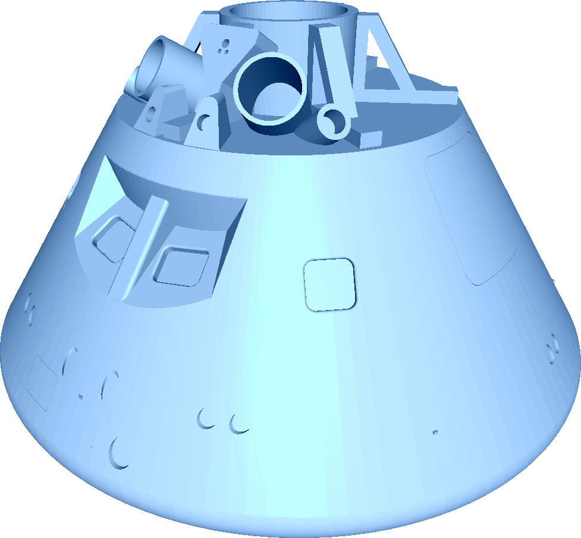

This folder contains various surface grids, remarks on where the data was obtained, and what was done with it. 

| Model Name | Image | PLY file      | Source     | Note |
|------------|-------|---------------|------------|------|
| Adirondacks   |  | [.stl](adirondacks.stl)  | [GrabCAD](https://grabcad.com/library/adirondack-park-elevation-model-1) |                           |
| Airfoil       |  | [.stl](airfoil.stl)      | [AMReX](http://git@github.com/AMReX-Codes/amrex-tutorials.git)           |                           |
| Armadillo     |  | [.stl](armadillo.stl)    | [Stanford](http://graphics.stanford.edu/data/3Dscanrep/)                 |                           |
| Dodecahedron  |  | [.stl](dodecahedron.stl) | [John Burkardt](https://people.sc.fsu.edu/~jburkardt/data/ply/ply.html)  |                           |
| Horse         |  | [.stl](horse.stl)        | [Alec Jacobson](https://github.com/alecjacobson/common-3d-test-models)   | Repaired using MeshLab    |
| Orion         |  | [.stl](orion.stl)        | [NASA](https://nasa3d.arc.nasa.gov/detail/orion-capsule)                 |                           |
| Sphere        |  | [.stl](sphere.stl)       | [John Burkardt](https://people.sc.fsu.edu/~jburkardt/data/ply/ply.html)  |                           |
