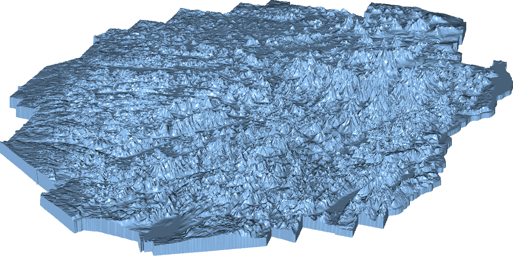

This folder contains various surface grids. The files that are listed below were obtained externally. See provided references. 

| Model Name | Image | Base file     | Source     | Note |
|------------|-------|---------------|------------|------|
| Adirondack    |  | [.stl](adirondack_binary.stl)   | [GrabCAD](https://grabcad.com/library/adirondack-park-elevation-model-1) |                           |
| Airfoil       |  | [.stl](airfoil_binary.stl)      | [AMReX](http://git@github.com/AMReX-Codes/amrex-tutorials.git)           |                           |
| Armadillo     |  | [.stl](armadillo_binary.stl)    | [Stanford](http://graphics.stanford.edu/data/3Dscanrep/)                 |                           |
| Dodecahedron  |  | [.stl](dodecahedron_binary.stl) | [John Burkardt](https://people.sc.fsu.edu/~jburkardt/data/ply/ply.html)  |                           |
| Horse         |  | [.stl](horse_binary.stl)        | [Alec Jacobson](https://github.com/alecjacobson/common-3d-test-models)   | Repaired using MeshLab    |
| Orion         |  | [.stl](orion_binary.stl)        | [NASA](https://nasa3d.arc.nasa.gov/detail/orion-capsule)                 |                           |
| Sphere        |  | [.stl](sphere_binary.stl)       | [John Burkardt](https://people.sc.fsu.edu/~jburkardt/data/ply/ply.html)  |                           |
  