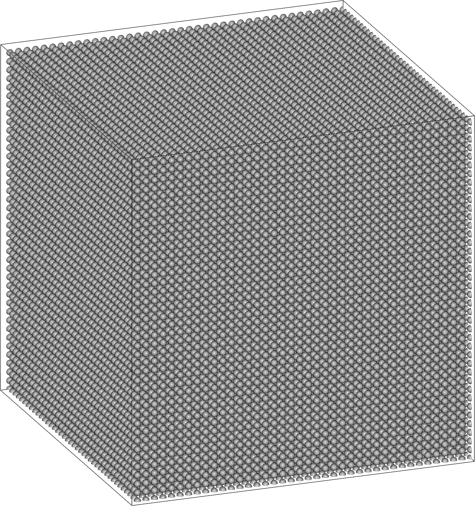
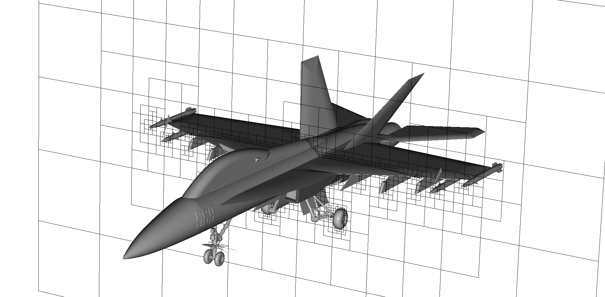

## EBGeometry

EBGeometry is a code for

1. Turning watertight and orientable surface grids into signed distance functions (SDFs).
2. Fast evaluation of such grids using bounding volume hierarchies (BVHs).
3. Providing fast constructive solid geometry (CSG) unions using BVHs. 

This code is header-only and can be dropped into any C++ project that supports C++14.
It was originally written to be used with embedded-boundary (EB) codes like Chombo or AMReX.
However, EBGeometry provides quite general SDFs, implicit functions, and CSG unions, and is useful beyond those codes. 

To clone EBGeometry:

    git clone git@github.com:rmrsk/EBGeometry.git

## Requirements

* A C++ compiler which supports C++14.

EBGeometry is a header-only library in C++ and has no external dependencies.
To use it, simply make EBGeometry.hpp visible to your code and include it.

## Documentation

User documentation is available as [HTML](https://rmrsk.github.io/EBGeometry/) or as a [PDF](https://github.com/rmrsk/EBGeometry/raw/gh-pages/ebgeometry.pdf).
A doxygen-generated API is [also available](https://rmrsk.github.io/EBGeometry/doxygen/html/index.html).

## Example quickstart

Several examples are given in the Examples folder.
To run one of the examples, navigate to the example and compile and run it.

### 1. Analytic distance fields

Use one of the analytic signed distance fields in EBGeometry:

```
cd Examples/EBGeometry_Shapes
g++ -O3 -std=c++14 main.cpp
./a.out
```

### 2. Creating an SDF from a surface grid

Read in an STL file and turn it into a signed distance field. 

```
cd Examples/EBGeometry_DCEL
g++ -O3 -std=c++14 main.cpp
./a.out
```

<p align="center">
   
</p>   

### 3. Fast CSG operations for analytic functions

Generate a spherical packed bed geometry using analytic representations of spheres.
BVH-accelerated CSG unions lead to order-of-magnitude faster implicit function evaluation.
```
cd Examples/EBGeometry_PackedSpheres
g++ -O3 -std=c++14 main.cpp
./a.out
```

<p align="center">
   
</p>   	   

### 4. Fast CSG on composite geometries

Create an F18 implicit function using CSG on each part (65 parts in total).

```
cd Examples/EBGeometry_F18
g++ -O3 -std=c++17 main.cpp -lstdc++fs
./a.out
```

<p align="center">
   
</p>   	

### 5. Advanced examples

Some complex examples that use Chombo3 or AMReX are also provided in the Examples folder.
These include application-specific code and require installation of Chombo3 or AMReX.

## Contributing

1. Create a branch for the new feature.

   ```
   git checkout main
   git pull
   git checkout -b my_branch
   ```
   
2. Develop the feature.

   ```
   git add .
   git commit -m "my commit message"
   ```

   If relevant, add Sphinx and doxygen documentation. 


3. Format the source and example codes using ```clang-format```:

   ```
   find Source Examples \( -name "*.hpp" -o -name "*.cpp" \) -exec clang-format -i {} +
   ```

4. Push the changes to GitHub

   ```
   git push --set-upstream origin my_branch
   ```
   
5. Create a pull request and make sure the GitHub continuous integration tests pass.

License
-------

See LICENSE and Copyright.txt for redistribution rights. 
