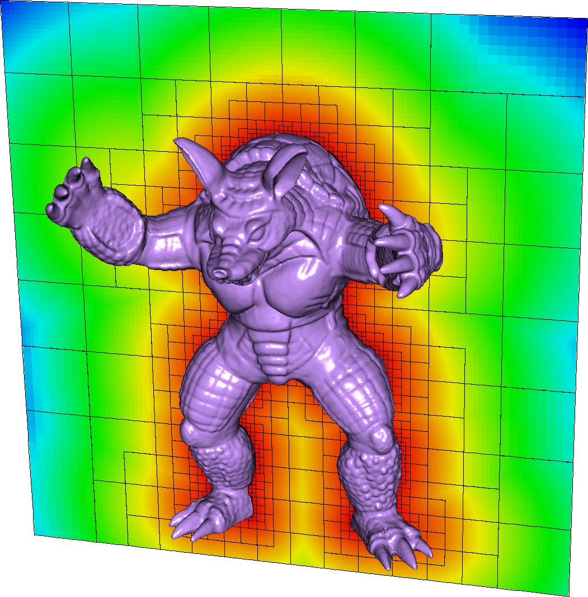
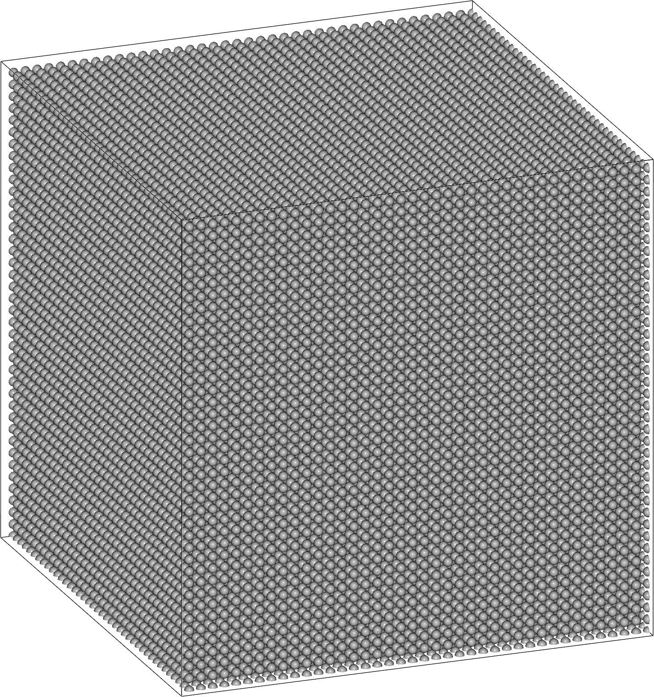

## EBGeometry

EBGeometry is a header-only C++17 library for turning surface geometry into fast, queryable
signed distance functions (SDFs).

* Turns surface meshes into SDFs, via a half-edge (DCEL) mesh representation or raw triangles.
* Fast SDF evaluation using bounding volume hierarchies (BVHs).
* Supports both pointer-based tree BVHs, and flattened, SIMD-accelerated packed BVHs.
* A library of analytic signed distance functions and implicit functions (spheres, boxes, and
  more)
* Composable with transforms (translation, rotation, scaling, rounding, blending).
* BVH-accelerated constructive solid geometry (CSG): unions, intersections, differences, and
  smooth blends, of both meshes and analytic shapes.
* Readers for triangulated surface meshes in STL, PLY, OBJ, and VTK format.
* Precision-templated.

EBGeometry has no external dependencies -- drop `EBGeometry.hpp` into any C++17 project and
include it. It was originally written for embedded-boundary (EB) codes like AMReX, but is useful
as a general-purpose SDF/CSG library.

<p align="center">
   
   
</p>

## Documentation

The EBGeometry documentation is updated on every pull request and is a live document that evolves
with the code. There are three types of documentation available:

* [HTML](https://rmrsk.github.io/EBGeometry/) -- The user guide: concepts, building, testing, and
  examples.
* [PDF](https://github.com/rmrsk/EBGeometry/raw/gh-pages/ebgeometry.pdf) -- The same user guide, as
  a single PDF.
* [Doxygen](https://rmrsk.github.io/EBGeometry/doxygen/html/index.html) -- The generated API
  reference for every class and function.

## Quickstart

Clone the repository, including the submodule that provides the example mesh files:

```bash
git clone --recurse-submodules https://github.com/rmrsk/EBGeometry.git
cd EBGeometry
```

Build and run the `MeshSDF` example, which reads a triangulated surface mesh and
evaluates it as a signed distance function:

```bash
cd Examples/MeshSDF
g++ -std=c++17 -O3 -march=native -I../.. main.cpp -o MeshSDF.ex
./MeshSDF.ex
```

This loads `armadillo.obj` from the `common-3d-test-models` submodule by default; pass a path to
run it on a different STL/PLY/OBJ/VTK file instead. `MeshSDF` -- like every example
under `Examples/` -- can also be built with [CMake](https://cmake.org/) or GNU make, see
[Examples/MeshSDF/README.md](Examples/MeshSDF/README.md) for the exact
commands, and the [Examples](https://rmrsk.github.io/EBGeometry/Examples.html) page for the full
list of bundled examples. 

Examples that couple EBGeometry to a third-party application code
(AMReX, Chombo) live under [`ThirdParty/`](ThirdParty/README.md) instead -- see its README
for an important caveat about how those are maintained.

## Build and test everything

The repository ships [CMake presets](https://cmake.org/cmake/help/latest/manual/cmake-presets.7.html)
that build the unit-test suite and every example under `Examples/` in one step, and run them
through `ctest`:

```bash
cmake --preset debug                # configure: Debug, assertions on, tests + examples enabled
cmake --build --preset debug --parallel $(nproc)

ctest --preset debug                # unit tests only (Catch2), sub-second
ctest --preset examples --parallel $(nproc)   # every example under Examples/, several minutes in Debug mode
```

`cmake --preset release-test` builds the same thing optimised (no assertions, AVX), and
`cmake --preset debug-san` additionally enables AddressSanitizer and UndefinedBehaviorSanitizer.
See [Contributing and testing](https://rmrsk.github.io/EBGeometry/Contributing.html) for the full
preset table, how to run a single test file, and `Scripts/run-all-checks.sh`, which reproduces
everything the continuous integration pipeline checks in one local command.

## Get help

If you encounter any issues when installing or using EBGeometry, you may obtain help through:

* [GitHub issues](https://github.com/rmrsk/EBGeometry/issues) -- bug reports and feature requests.
* [GitHub discussions](https://github.com/rmrsk/EBGeometry/discussions) -- usage questions and
  everything else.

## Contribute

We welcome contributions to EBGeometry -- the best approach is either to reach out to us to see
if we have time to implement a specific feature, or fork the repository and submit a pull request.
See [Contributing and testing](https://rmrsk.github.io/EBGeometry/Contributing.html) in the user
guide for how to build and run the test suite locally, what the continuous integration pipeline
checks, and the code style/conventions expected of contributions.

## AI usage

As of 2026, we have begun to take advantage of expert-steered AI development. A CLAUDE.md lives 
in this project, which can be used to steer Claude code. Code contributions written by an AI 
coding agent are thus welcome. All *merged* code, however, is always reviewed by a human before
accepted.
